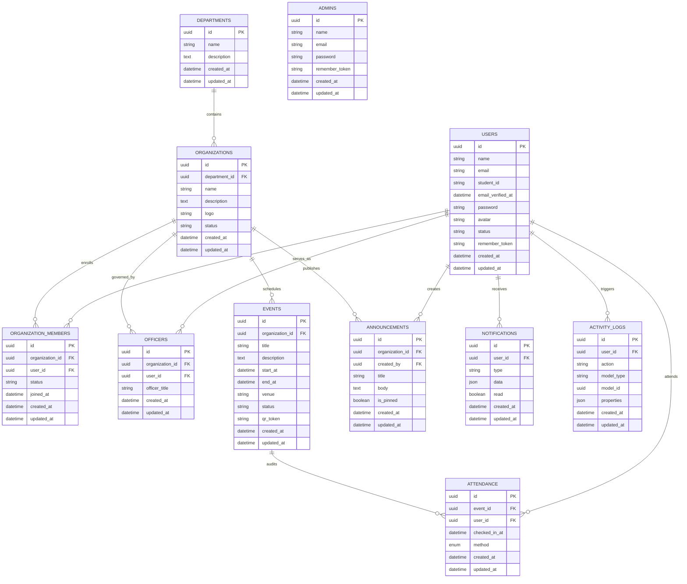
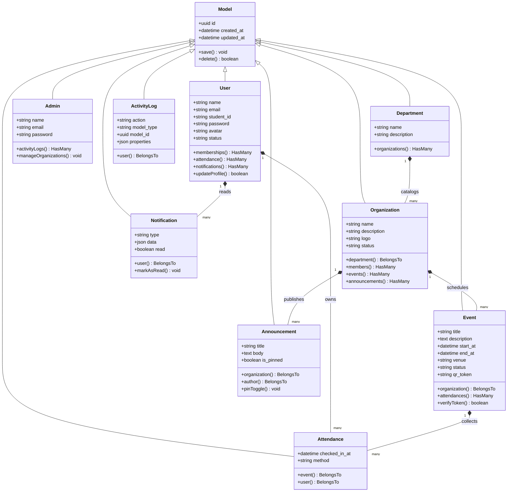

# Republic of the Philippines
# Province of Cebu
# Municipality of Cordova

## CORDOVA PUBLIC COLLEGE
**Gabi, Cordova, Cebu 6017**

---

# SYSTEM ANALYSIS AND DESIGN DOCUMENTATION
### STUDENT ORGANIZATION MANAGEMENT SYSTEM (SOMS)

**Course Code / Requirement:** Capstone Project / IT ELEC 3 & Human Computer Interaction 2  
**Date of Submission:** May 20, 2026  

---

## 1. SYSTEM OVERVIEW

### 1.1 Introduction
The Student Organization Management System (SOMS) is a modern, high-fidelity web application engineered to centralize, streamline, and automate student organization operations, member roster records, event planners, announcements bulletins, and compliance auditing. 

Built using a dual-portal framework, SOMS separates administrative and student operations into isolated, secure environments. The frontend is powered by Next.js, TypeScript, and Tailwind CSS, providing a responsive, glassmorphic layout. The backend is powered by Laravel 11, implementing a robust, dual-guarded RESTful API supported by a relationally normalized database layer.

### 1.2 Background of the Study
At Cordova Public College, student organizations are central to campus life, driving engagement, community projects, and skill development. However, managing these clubs manually involves high clerical overhead:
* **Paper-based Rosters**: Roster sheets, member counts, and membership approvals are managed via paper files or scattered spreadsheets, leading to sync issues.
* **Disconnected Communication**: Club announcements are pinned to physical boards or social media pages where they are easily missed.
* **Attendance Auditing Bottlenecks**: Event check-ins are recorded manually on paper sheets, resulting in transcription errors and long lines during entry.
* **Inaccurate Report Generation**: Reconstructing physical rosters and check-in times to generate compliance reports is slow and prone to errors.

SOMS replaces these legacy procedures with a real-time administrative cockpit and student dashboard, eliminating physical friction points and providing audited tracking.

### 1.3 Objectives
* **Centralize Club Portals**: Establish distinct workspaces for System Administrators and Student Members.
* **Automate Roster Approvals**: Provide digital membership request tracking, from "Pending" review to "Approved" active status.
* **Implement QR Code Check-ins**: Generate unique QR codes for campus events and validate arrivals using dynamic token validation.
* **Streamline Multi-Level Communications**: Allow administrators and organization officers to compose, edit, and pin bulletins to a shared student feed.
* **Audit and Report**: Generate printable compliance logs, audit trails, and data graphs without third-party hydration delays.

### 1.4 Scope and Limitations
#### Scope:
* **Admin Guarded Portal**: Accounts verification, department setup, organization registration, officer assignments, event planners, announcement pinning, activity logs tracking, and media print exports.
* **Member Guarded Portal**: Roster requests, dynamic club directory exploration, event schedule feeds, self-check-ins via QR code tokens, and profile avatar uploads.
* **API Validation**: Cross-guard middleware authorization, complete data filtering, and secure token storage.

#### Limitations:
* **Internal Network Dependability**: Requires a network connection to synchronise frontend Next.js states with the Laravel MySQL backend.
* **Predefined Roles**: Supports Administrator, Student Member, and Organization Officer roles; custom dynamic permission configurations are managed at the database seed level.

### 1.5 Beneficiaries
* **College Administrators**: Gain centralized control over departments, registered organizations, and active rosters.
* **Organization Officers**: Streamline event organization, dispatch announcements, and track rosters without manual record-keeping.
* **Student Body**: Get instant access to club applications, real-time event schedules, and instant QR check-in capabilities.
* **Registrars and Auditors**: Access verified attendance sheets, activity logs, and exportable PDFs.

---

## 2. SYSTEM ANALYSIS

### 2.1 Existing System Analysis
The legacy workflow at Cordova Public College relies on manual tasks, raising administrative overhead:

```
[Student fills paper form] ➔ [Officer collects form] ➔ [Manual copy to Excel] ➔ [Delayed registration]
[Physical check-in sheet]  ➔ [Manual transcription] ➔ [Report generation]     ➔ [Prone to data loss]
```

### 2.2 Proposed System
SOMS replaces manual spreadsheets and paper forms with a fully automated, digital database matching system:

```
Next.js Frontend (Axios) ➔ Laravel dual-guard RESTful API ➔ MySQL DB (Normalized tables)
```

This system provides:
* **Immediate Roster Updates**: Joining a club triggers a `POST` request to the backend database, immediately listing the user as pending.
* **Robust Attendance Tracking**: Generating an event creates a secure `qr_token` that students submit via their phones to log attendance in real time.
* **Immutable Activity Logs**: System modifications are automatically audited in an activity log table, ensuring full operational transparency.

### 2.3 Functional Requirements
* **FR-01: Portal Isolation**: The system must run distinct authentication portals at `/admin/login` and `/login`.
* **FR-02: Member Profile Management**: Members can edit their profile details and upload custom avatar images.
* **FR-03: Roster Request Tracking**: Students can apply to join clubs, transitioning their status from `pending` to `approved` or `rejected`.
* **FR-04: Event Creation**: Administrators can plan events, designate venues, and generate secure `qr_token` strings.
* **FR-05: Dynamic QR Attendance**: The system must validate submitted event tokens and log user arrivals.
* **FR-06: Announcement Pinning**: Users can create announcements and pin them to the top of the student dashboard.
* **FR-07: Media Print Generation**: The system must support print styling rules to generate clean physical reports.
* **FR-08: Activity Logs Auditing**: The system must automatically record administrative actions in a persistent database log.

### 2.4 Non-Functional Requirements
* **NFR-01: Performance**: API endpoints must respond in less than 200ms under standard network conditions.
* **NFR-02: Accessibility**: The UI must follow strict semantic standards and ensure appropriate text contrast.
* **NFR-03: Security**: Passwords must be hashed using `bcrypt` and shielded behind Laravel guards.
* **NFR-04: Reliability**: The system must include safe fallbacks (e.g., dynamic initials generators) to prevent UI crashes if optional attributes are missing.
* **NFR-05: Mobile Responsiveness**: The interface must adapt seamlessly to standard screen sizes using a responsive sidebar navigation.

### 2.5 User Roles and Permissions

| Role | Target Routes | Permissions / Capabilities |
| :--- | :--- | :--- |
| **System Administrator** | `/admin/*` | Full access: manage users, departments, organizations, officer rosters, event codes, announcement pins, system activity logs, and physical report generation. |
| **Organization Officer** | `/dashboard`, `/organizations` | Intermediate access: write club announcements, coordinate events, view member rosters, and review attendance logs. |
| **Student Member** | `/dashboard`, `/profile`, `/events` | Standard access: browse organizations, apply for memberships, view active events, submit check-in tokens, and modify profile avatars. |

---

## 3. STORYBOARD

SOMS utilizes a dark, glassmorphic theme across its layouts. This design is built on a responsive structural grid with custom visual badges, harmonious contrast, and smooth animations.

### 3.1 Login Page (`/admin/login` and `/login`)
* **Purpose**: Provides separate login portals for Administrators and Student Members.
* **User Interactions**: Form inputs for Email and Password, validation triggers, and toggle options to switch between standard student and administrative entry points.
* **Components**: Form wrapper card with a frosted glass layout, loading buttons, and responsive alerts.
* **Navigation Flow**: Successful login redirects members to `/dashboard` and administrators to `/admin/dashboard`. Unauthorized attempts trigger instant form validation alerts.
* **UI Behavior**: Highlights active input borders, displays smooth transitions, and renders loading indicators during server validation.

### 3.2 Register Page (`/register`)
* **Purpose**: Enables standard student accounts creation.
* **User Interactions**: Input fields for Full Name, Student ID, Email Address, and Password.
* **Components**: Glassmorphic form panels and standard interactive input bars.
* **Navigation Flow**: Successful registration automatically signs the student in and routes them to the dashboard.
* **UI Behavior**: Automatically validates Student ID formats, tracks password matching, and locks the submit button during submission.

### 3.3 Admin Dashboard Page (`/admin/dashboard`)
* **Purpose**: Provides administrators with a high-level overview of active statistics, active club ratios, and pending tasks.
* **User Interactions**: Quick links to department settings, system logs, active user indexes, and organizational lists.
* **Components**: Stats cards, dynamic layout graphs, navigation panels, and warning lists.
* **Navigation Flow**: Serves as the admin index page, branching out to `/admin/members`, `/admin/organizations`, and `/admin/reports`.
* **UI Behavior**: Renders metrics dynamically, displays glowing outline tags, and uses clear color coding to flag pending items.

### 3.4 Member Dashboard Page (`/dashboard`)
* **Purpose**: Serves as the central landing page for signed-in students, showing active metrics, upcoming events, club announcements, and a quick check-in widget.
* **User Interactions**: Links to browse clubs, details of upcoming schedules, and input forms to submit check-in tokens.
* **Components**: Stats indicators, upcoming schedule feeds, announcement bulletins, and attendance forms.
* **Navigation Flow**: Links to club directories (`/organizations`) and event listings (`/events`).
* **UI Behavior**: Features a responsive sidebar, shows animated warnings for pending club requests, and triggers popups for successful check-ins.

### 3.5 Organizations Page (`/admin/organizations` and `/organizations`)
* **Purpose**: Manages and displays the directory of active organizations on campus.
* **User Interactions**: Directory search filters, department selectors, and buttons to apply for memberships.
* **Components**: Search boxes, department drop-down menus, and glassmorphic club cards.
* **Navigation Flow**: Standard index layout. Clicking a card navigates to `/organizations/[id]`.
* **UI Behavior**: Dynamically filters results as users type, handles empty states cleanly, and provides loading indicator icons.

### 3.6 Events Page (`/admin/events` and `/events`)
* **Purpose**: Schedules and indexes academic and social events on campus.
* **User Interactions**: Text search, calendar view toggle, and detail buttons.
* **Components**: Search inputs, status selectors, and event cards.
* **Navigation Flow**: Clicking "View Details" navigates to `/events/[id]`.
* **UI Behavior**: Displays color-coded badges for event statuses (e.g. green for ongoing, amber for upcoming, red for cancelled).

### 3.7 Announcements Page (`/admin/announcements` and `/dashboard` bulletins)
* **Purpose**: Creates and displays official bulletins and announcements.
* **User Interactions**: Create, edit, delete, and pin announcements.
* **Components**: Rich input text fields and pinned alert panels.
* **Navigation Flow**: Handled via modular modals on the dashboard.
* **UI Behavior**: Pinned bulletins are highlighted with a glowing violet border and pinned dynamically to the top of the feed.

### 3.8 Attendance Page (`/admin/events/[id]` Roster and Event Details Check-in)
* **Purpose**: Logs and audits student check-ins.
* **User Interactions**: Manual check-in forms, delete entry keys, and PDF print exports.
* **Components**: Attendance tables, manual input bars, and action lists.
* **Navigation Flow**: Integrated directly inside individual event pages.
* **UI Behavior**: Displays warning alerts if a user is already checked in, and lists check-in times in clear tabular formats.

### 3.9 Profile Page (`/profile`)
* **Purpose**: Allows users to manage their account details and upload profile avatars.
* **User Interactions**: Name, Email, and Student ID inputs, and drag-and-drop avatar file uploads.
* **Components**: Profile details forms and avatar file drag-and-drop zones.
* **Navigation Flow**: Standard route at `/profile`.
* **UI Behavior**: Validates image types and sizes on the client side, showing an immediate preview of the uploaded avatar.

---

## 4. USE CASE DIAGRAM

### 4.1 Actors
* **System Administrator**: The top-level system operator, responsible for managing departments, approving clubs, auditing actions, and generating reports.
* **Student Member**: Standard student user, responsible for exploring clubs, submitting roster requests, and checking into events.
* **Organization Officer**: Advanced student user, assigned to manage club events, write announcements, and review attendance logs.

### 4.2 Use Case Relationships
* **General System Boundary**: Separates the student portals from administrative controls.
* **Dependencies**: All key management actions require a valid, active session.

### 4.3 UML Use Case Diagram (Mermaid)

```mermaid
usecaseDiagram
    actor Admin as "System Administrator"
    actor Officer as "Organization Officer"
    actor Member as "Student Member"

    left to right direction

    rectangle SOMS_System_Boundary {
        usecase UC_Login as "Authenticate Session
        (Login)"
        usecase UC_Register as "Register Student Account"
        usecase UC_Manage_Deps as "Manage Departments"
        usecase UC_Manage_Orgs as "Manage Organizations"
        usecase UC_Approve_Memb as "Approve Club Members"
        usecase UC_Manage_Events as "Manage Events & Venues"
        usecase UC_QR_Checkin as "Log Attendance (QR Code/Token)"
        usecase UC_Post_Ann as "Post & Pin Announcements"
        usecase UC_Gen_Reports as "Generate Compliance Reports"
        usecase UC_Audit_Logs as "Audit System Activity Logs"
        usecase UC_Edit_Profile as "Edit Profile & Upload Avatar"
    }

    Member --> UC_Register
    Member --> UC_Login
    Member --> UC_Edit_Profile
    Member --> UC_QR_Checkin
    Member --> UC_Post_Ann : "Read Only"

    Officer --> UC_Login
    Officer --> UC_Approve_Memb
    Officer --> UC_Manage_Events
    Officer --> UC_Post_Ann
    Officer --> UC_QR_Checkin : "Review Logs"

    Admin --> UC_Login
    Admin --> UC_Manage_Deps
    Admin --> UC_Manage_Orgs
    Admin --> UC_Approve_Memb
    Admin --> UC_Manage_Events
    Admin --> UC_Post_Ann
    Admin --> UC_Gen_Reports
    Admin --> UC_Audit_Logs
```

---

## 5. ENTITY RELATIONSHIP DIAGRAM (ERD)

SOMS uses a normalized relational database design to maintain database consistency, ensure referential integrity, and maximize query efficiency.

### 5.1 Tables Schema Specification

* **`admins`**: Stores system administrators. Primary Key is `id` (UUID).
* **`users`**: Stores students and officers. Primary Key is `id` (UUID).
* **`departments`**: Academic subdivisions on campus. Primary Key is `id` (UUID).
* **`organizations`**: Campus clubs. Connects to `departments` via a foreign key `department_id`. Primary Key is `id` (UUID).
* **`organization_members`**: Roster mapping table. Connects to `users` and `organizations` via foreign keys.
* **`officers`**: Assigns specific users as club officers. Connects to `users` and `organizations`.
* **`events`**: Campus events. Connects to `organizations` via `organization_id` and includes a `venue` column.
* **`attendance`**: Records event check-ins. Uses a unique constraint on `['event_id', 'user_id']` to prevent duplicate check-ins.
* **`announcements`**: Club updates. Connects to `organizations` via `organization_id` and is created by a user (`created_by`).
* **`notifications`**: System notifications for users. Connects to `users` via `user_id`.
* **`activity_logs`**: System audit trails. Captures administrative actions.

### 5.2 Database ERD Diagram (Mermaid)



---

## 6. CLASS DIAGRAM

The backend architecture is structured around key models, relationships, and custom API resource classes.

### 6.1 UML Class Diagram (Mermaid)



---

## 7. SYSTEM ARCHITECTURE

SOMS uses a modern web stack that decouples frontend user interactions from backend database operations:

```
+---------------------------------------+
|           Next.js Frontend            |
|  - React Client & UI Rendering        |
|  - Local State via store (Sanctum)    |
|  - Styled with Tailwind CSS           |
+---------------------------------------+
                   │
                   ▼ (HTTP / Axios Requests)
+---------------------------------------+
|         Laravel RESTful API           |
|  - Dual Guard Router Shielding        |
|  - Form Controllers & Validations     |
|  - Eloquent DB ORM Mapping            |
+---------------------------------------+
                   │
                   ▼ (SQL Database Queries)
+---------------------------------------+
|             MySQL Database            |
|  - Relationally Normalized Tables     |
|  - Unique Constraints & Indexes       |
+---------------------------------------+
```

### 7.1 Frontend Structure
The frontend application is built in Next.js, featuring:
* **`services/api.ts`**: The main Axios configuration layer, automatically handling API headers, base URL mappings, and routing unauthorized users (`401`) back to appropriate login portals.
* **`store/`**: Separates frontend stores for Administrators (`adminAuthStore`) and Members (`memberAuthStore`).
* **Route Group Pattern (`(member)` route group)**: Isolates student routes under a shared layout framework. This structure separates student dashboard rendering (`/dashboard`, `/profile`, `/organizations`, `/events`) from administrative routes.

### 7.2 Backend Structure
The backend is powered by Laravel 11 and structured into clear sub-namespaces:
* **Controllers**: Separated into `App\Http\Controllers\Admin\*` and `App\Http\Controllers\Member\*`.
* **Database Models**: Contained within `App\Models\*`. Models inherit dynamic database capabilities (e.g. `HasUuids` traits) to handle secure string routing instead of exposing auto-incrementing integer IDs.

---

## 8. UI/UX DESIGN EXPLANATION

### 8.1 Styling System and Glassmorphism
SOMS utilizes Tailwind CSS to implement a premium, dark glassmorphic design language:
* **Backgrounds**: Frosted glass panels styled with deep slate and translucent overlays (`bg-slate-900/10`, `backdrop-blur-md`).
* **Interactive Elements**: Borders glowing with harmonized violet-indigo hues (`border-slate-800`, hover: `border-slate-700/80`).
* **Visual Hierarchy**: Curated high-contrast typography (monospaced date badges, bold headings, and clean slate body text).

### 8.2 Responsive Layout and Sidebar
* **Desktop Structure**: Includes a persistent, styled navigation sidebar with links to the dashboard, club directory, events calendar, and profile.
* **Mobile Adaptability**: A custom responsive hamburger menu allows users to toggle the sidebar smoothly on mobile devices, preventing layout shift.

### 8.3 Form Validation and Stability Failbacks
* **Client-Side Validation**: Forms enforce required fields, validate email patterns, and check student ID structures before sending data to the server.
* **TypeScript Integrity**: The entire codebase is verified compile-safe using strict type checking (`npx tsc --noEmit`), eliminating type-related crashes.
* **Acronym Initials Generator**: If an organization acronym is missing in the database, the UI uses a dynamic initials generator to calculate initials from the organization name. This prevents the application from crashing on undefined properties:
  `org.name.split(' ').filter(Boolean).map(n => n[0]).join('')`

---

## 9. SECURITY AND AUTHENTICATION

```
[Student Portals /login] ----> Sanctum API Token Guard (member) ----> Database [users]
[Admin Portals  /admin]  ----> Sanctum API Token Guard (admin)  ----> Database [admins]
```

### 9.1 Separate Authentication Guards
To secure administrative actions, SOMS isolates the student and administrator databases:
* **Student Authentication**: Authenticates against the `users` table via `config/auth.php` using the standard `web` / `member` guards.
* **Admin Authentication**: Uses the separate `admins` database table via a dedicated `admin` guard. This separation prevents a compromised student token from accessing administrative functions.

### 9.2 Hashing and Token-Based Middleware Protection
* **Bcrypt Hashing**: User and administrator passwords are encrypted using strong `bcrypt` algorithms before database storage.
* **Route Shielding**: Laravel routes are protected by middleware guards (`auth:sanctum`), rejecting unauthorized requests with standard `401 Unauthorized` responses.
* **SQL Injection Prevention**: All database queries are run using Laravel Eloquent's parameterized PDO bindings, preventing SQL injection attacks.

---

## 10. CONCLUSION & FUTURE RECOMMENDATIONS

### 10.1 Summary
The Student Organization Management System (SOMS) is a modern web application designed for Cordova Public College. It replaces slow, error-prone manual spreadsheets with a high-performance database management system. 

SOMS separates standard student features (roster requests, event calendars, profile customization, and QR code check-ins) from administrative tools (roster approvals, department management, event generation, and audited activity logs). The system is fully type-safe, responsive, and ready for CAPSTONE deployment.

### 10.2 Recommendations and Future Improvements
* **Direct QR Code Scanning**: Integrate direct camera scanning features (`html5-qrcode`) on mobile devices, allowing officers to scan students' physical badges directly.
* **Offline Attendance Syncing**: Develop a local storage synchronization queue (using Service Workers) to temporarily log event attendance offline during network outages, syncing records once connectivity is restored.
* **Integrated Push Notifications**: Integrate standard Web Push notification APIs to alert students of urgent club announcements even when their browser is closed.
* **Excel/CSV Member Imports**: Add batch-import tools for administrators to register large student rosters and departments using Excel/CSV files.
